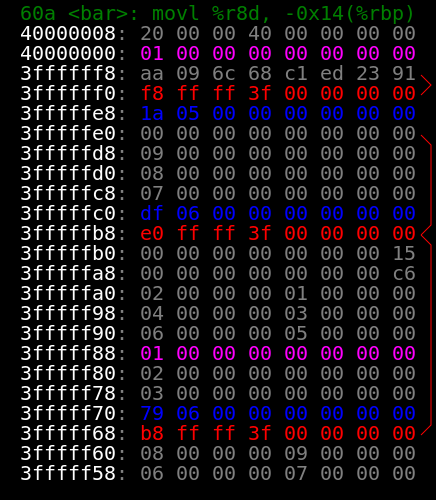

# Stack Frame Inspector

A simple BAP plugin, useful for education purposes mostly, that inspects and prints the stack frame during program execution. The plugin uses Primus interepreter to emulate the program and supports various modes of execution, including symbolic execution. The stack frames could be printed in XML, SVG, and orgmode formats. The SVG output was tested in a chromium-based browser and there's no guarantee that it will work for all browsers and rendering engines. Below is the sample frame generated from the SVG output,


Several simple inspectors (analyses that inspect the contents of the frame) are implemented:

- Blocks Inspector detects references to the basic blocks, highlighted with blue in the SVG output;
- Slot References Inspector detects references to other stack slots, blue color in SVG;
- Back References Inspector detects references to other stack slots, designated with a red line to the right of the frame;
- Function Arguments Inspector detects function arguments, highlighted as magenta in SVG.

# Usage

The plugin supports stream or paginated output. In the stream output all information is dumped into the standard output stream. It doesn't work for the SVG mode, though. The paginated output generates a file per each frame, e.g.,
```
bap examples/e2 --framespector --framespector-format=svg --framespector-paginate-prefix=e2
```

This command will emulate the `examples/e2` (do `make examples/e2` to build it) and print the stack frames into a series of files with each file named `e2-xxxx.svg` where `xxxx` is the stack frame number. If you open a frame in a web browser, e.g., `x-www-open e2-0030.svg`, then you can click anywhere on the frame to open the next frame. Use the standard navigation facilities of your browser to navigate back.


# Building with OPAM

If you have opam installed, then install bap (if you haven't yet) and build and install the plugin
```
opan install bap
bapbuild -pkg bap-primus framespector.plugin
bapbundle install framespector.plugin
```

# Building with docker


```
docker build -t framespector .
```
